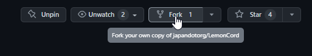

# Contributing

Contributions are always welcome!

<strong> Please carefully read the page to make the code review process go as smoothly as possible and to maximize the likelihood of your contribution being merged. </strong>

## Bug Reports

For bug reports or requests [submit an issue](https://github.com/japandotorg/LemonCord/issues/new/choose) instead.

## Pull Requests

The preffered way to contribute is to fork the [main repository](https://github.com/japandotorg/LemonCord) on Github.

1. Fork the [main repository](https://github.com/japandotorg/LemonCord). Click on the 'Fork' button near the top of the page. This creates a copy of the code under your account on the Github server. 



2. Clone this copy to your local disk:

```sh
$ git clone https://github.com/<your-username>/LemonCord.git
$ cd LemonCord
```

3. Create a branch to hold your changes and start making changes. Don't work in the `main` branch!

```sh
$ git checkout -b my-feature
```

4. Work on this copy on your machine using Git to do the version control. When you're done editing, run the following to record your changes in Git:

```sh
$ git add .
$ git commit -m "I changed this"
```

5. Push your changes to GitHub with:

```sh
$ git push -u origin my-feature
```

6. Press contribute on your branch.


7. Now, make sure to type up a descriptive summary of your changes and anything furthur you would like to note about the changes inside the bot. State in breif details on the changes inside the Pull Request.

8. Finally, open the Pull Request to send your changes for review & wait for any response.

### Github Pull Requests Docs

If you're not familiar with pull requests, please consider checking the [pull request docs](https://help.github.com/articles/using-pull-requests/).

## General guidelines

Because we want to keep everything as consistent and clean as possible, here are some guidelines we strongly recommend you to try to follow when making a contribution.

### Spelling, grammer, and wording

Improper grammar, strange wording, and incorrect spelling are all things that may lead to confusion when a user reads a guide page. It's important to attempt to keep the content clear and consistent. Re-read what you've written and place yourself in the shoes of someone else for a moment to see if you can fully understand everything without any confusion.

Don't worry if you aren't super confident with your grammar/spelling/wording skills; all pull requests get thoroughly reviewed, and comments are left in areas that need to be fixed or could be done better/differently.

### Paragraph structure

Tied in with the section above, try to keep things as neatly formatted as possible. If a paragraph gets long, split it up into multiple paragraphs so that it adds some spacing and is easier on the eyes.

### Git ignore

Please make sure to git ignore any unnecessary file like `.env` or anything similar if it's not already ignored.

### New lines.

- Please make sure to keep 2 new line spaces before every function.
- Please make sure to keep an empty new line in end of every file, i.e., the last line must always be a new/empty line.

### Versioning

Increase the version number in any file and the README.md to the new version that this Pull Request would represent. The versioning scheme we use is [Semantic Versioning](http://semver.org/).
